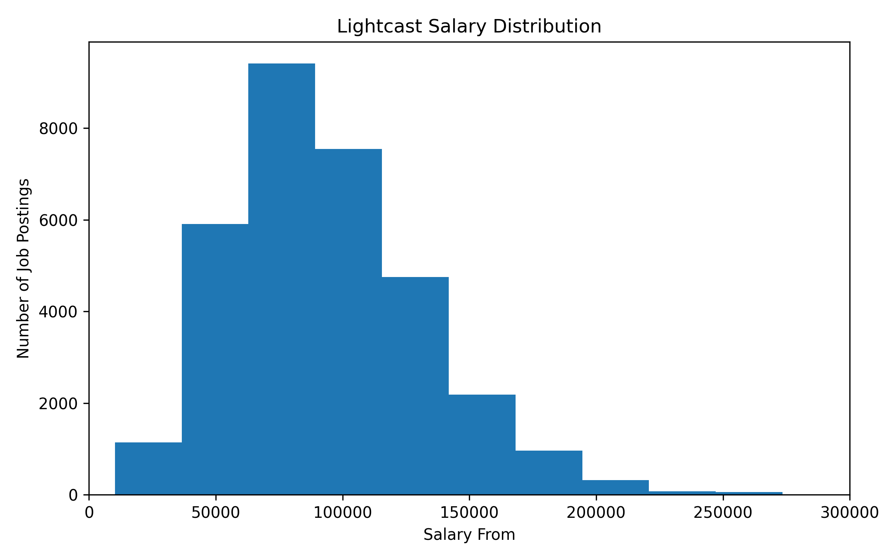
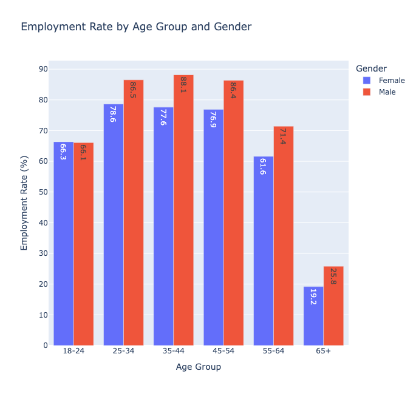
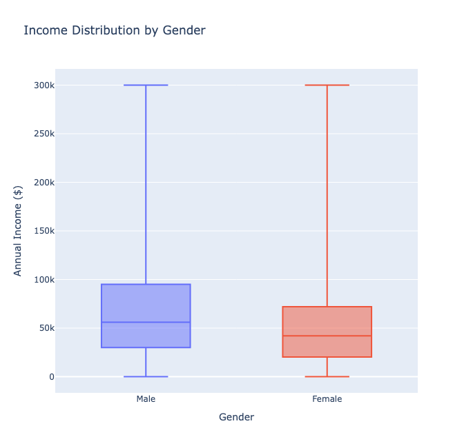

## Overview

Exploratory Data Analysis of the 2024 Lightcast job postings and IPUMS employment datasets.

---

## Alina: Salary Analysis from Lightcast

This section analyzes salary information from Lightcast job postings. The salary table contains 72,498 job postings, but only 32,398 postings include salary information, meaning approximately 55.3% of postings do not disclose salary fields.



The salary distribution shows that most postings with disclosed salary information cluster below the highest-paying outliers. The median lower-bound salary is approximately $88,000, while the mean is about $94,005, suggesting a right-skewed distribution.


The boxplot confirms that salary postings contain substantial high-end outliers. This suggests that salary transparency and compensation levels vary widely across job postings and occupational categories.

## Alina: IPUMS Industry Distribution Analysis

The IPUMS dataset contains 264 industry categories.


The histogram illustrates the distribution of industry codes across the lookup table.

---

## Julie: Gender & Wages (IPUMS)

### Setup

```{python}
import sys
sys.path.insert(0, "..")
from analysis.utils import load_employment, PLOTLY_THEME, save_fig
import plotly.express as px

df_emp = load_employment()
print(f"Rows: {len(df_emp):,} | Columns: {list(df_emp.columns)}")
```

### Gender Wage Gap by Industry

```{python}
agg = (df_emp.groupby(["INDUSTRY", "SEX_LABEL"])["INCWAGE"]
       .mean().reset_index()
       .rename(columns={"INCWAGE": "AVG_WAGE"}))

fig_a1 = px.bar(
    agg, x="AVG_WAGE", y="INDUSTRY",
    color="SEX_LABEL", barmode="group",
    orientation="h",
    title="Average Wage by Industry and Gender",
    labels={"AVG_WAGE": "Avg Annual Wage", "INDUSTRY": "Industry"},
    **PLOTLY_THEME
)
save_fig(fig_a1, "julie_gender_wage_industry")
fig_a1.show()
```

Men out-earn women in every one of the 18 industries. The gap is widest in Management, where men average USD 143,608 against USD 84,137 for women, a USD 59,471 difference that leaves women earning just 59 cents for every male dollar, followed by Administrative Services (USD 45,308 gap) and Healthcare (USD 32,410). The gap is narrowest in Public Administration, where women earn 94 percent of male wages (a USD 4,507 difference), along with Construction and Mining at roughly 89 percent. Even the most equitable industry still shows a measurable shortfall, and across all employed workers women earn 70.6 cents for every dollar earned by men.

### Gender Wage Gap by State

```{python}
agg_state = (df_emp.groupby(["STATE_NAME", "SEX_LABEL"])["INCWAGE"]
             .mean().reset_index()
             .rename(columns={"INCWAGE": "AVG_WAGE"}))

fig_a2 = px.choropleth(
    agg_state,
    locations="STATE_NAME",
    locationmode="USA-states",
    color="AVG_WAGE",
    scope="usa",
    facet_col="SEX_LABEL",
    title="Average Wage by State and Gender",
    **PLOTLY_THEME
)
save_fig(fig_a2, "julie_gender_wage_state")
fig_a2.show()
```

The wage gap holds across all states, but its size varies geographically. It is widest in higher-wage states such as Connecticut (USD 34,906), Utah (USD 34,485), New Jersey (USD 34,151), Washington, and Massachusetts, and narrowest in South Dakota (USD 17,084), Iowa, Hawaii, Arkansas, and Wyoming. The pattern suggests male wages scale up faster than female wages as a state's overall wage level rises, so prosperity alone does not narrow the divide and may even widen it in absolute terms.

---

## Julie: Job Market Trends (Lightcast)

### Setup

```{python}
from analysis.utils import load_job_postings, load_location, save_fig
import plotly.express as px

df_jobs = load_job_postings()
print(f"Job postings: {len(df_jobs):,} | Columns: {list(df_jobs.columns)}")
```

### B2 — Postings by State

```{python}
df_loc = load_location()
df_jobs_state = (df_jobs
    .merge(df_loc[["ID", "STATE_CODE"]], on="ID", how="left")
    .dropna(subset=["STATE_CODE"]))

agg_state = (df_jobs_state.groupby("STATE_CODE")
             .size().reset_index(name="POSTING_COUNT")
             .sort_values("POSTING_COUNT", ascending=False))

fig_b2 = px.bar(
    agg_state, x="STATE_CODE", y="POSTING_COUNT",
    title="Job Postings by State",
    labels={"STATE_CODE": "State", "POSTING_COUNT": "Postings"},
    **PLOTLY_THEME
)
save_fig(fig_b2, "julie_postings_by_state")
fig_b2.show()
```

Job-posting demand is heavily concentrated geographically. Of 68,536 postings with an identifiable state, the top five, namely Texas (7,793), California (6,885), New York (5,251), the District of Columbia (3,744), and Florida (3,521), account for 39.7 percent of all activity. Demand clusters in large, high-output economies. These are raw counts rather than per-capita rates, so part of the concentration reflects population size, and a per-capita view could reorder smaller jurisdictions such as the District of Columbia upward.

---

## Julie: Female Wage vs Job Market Activity (Cross-Dataset)

### Setup

```{python}
from analysis.utils import build_cross_state

cross = build_cross_state(df_emp, df_jobs_state)
r_f = cross[cross["SEX_LABEL"]=="Female"]["AVG_WAGE"].corr(cross[cross["SEX_LABEL"]=="Female"]["POSTING_COUNT"])
r_m = cross[cross["SEX_LABEL"]=="Male"]["AVG_WAGE"].corr(cross[cross["SEX_LABEL"]=="Male"]["POSTING_COUNT"])
print(f"States: {cross['STATE_CODE'].nunique()} | r Female={r_f:.3f} | r Male={r_m:.3f}")
```

### C1 — Wage vs Job Posting Volume by State and Sex

```{python}
fig_c1 = px.scatter(
    cross,
    x="POSTING_COUNT",
    y="AVG_WAGE",
    color="SEX_LABEL",
    facet_col="SEX_LABEL",
    hover_name="STATE_CODE",
    hover_data={"STATE_CODE": False, "POSTING_COUNT": True, "AVG_WAGE": ":.0f"},
    title="Avg Wage vs Job Posting Volume by State — Female vs Male",
    labels={
        "POSTING_COUNT": "Job Postings (Lightcast)",
        "AVG_WAGE": "Avg Wage (IPUMS)",
        "SEX_LABEL": "Sex"
    },
    **PLOTLY_THEME
)
fig_c1.update_traces(marker=dict(size=8), selector=dict(mode="markers"))
save_fig(fig_c1, "julie_cross_state_comparison")
fig_c1.show()
```

Across all 51 states, average wage and posting volume are positively but only moderately correlated, and the relationship is nearly identical for women (r = 0.396) and men (r = 0.411). States with more hiring activity tend to pay more, consistent with strong labor demand lifting wages. Because the correlation is almost the same for both sexes, job-market activity relates to wages in much the same way regardless of gender and therefore does not by itself explain the persistent wage gap documented in the industry and state analyses above.

---


---

## Antara: Gender Disparities in IT vs Overall Workforce (IPUMS & Lightcast)

This analysis focuses on comparing the **IT workforce** against the **overall workforce** using the 2024 IPUMS employment dataset and the Lightcast job postings dataset. The IT workforce is defined as workers with Census occupation codes between **1000 and 1999**, which correspond to computer, mathematical, and information technology occupations — directly aligned with the types of roles captured in the Lightcast dataset.

The decision to compare IT workers specifically against the overall workforce — rather than other sectors such as healthcare, education, or finance — is intentional. The Lightcast dataset is heavily concentrated in IT and data-related job postings (over 93% of postings fall under Information Technology and Computer Science). By isolating IT workers in the IPUMS data and benchmarking them against the broader workforce, we can identify whether gender disparities in wages and representation are unique to the IT sector or reflect a wider systemic pattern. This cross-dataset perspective allows for a more meaningful and targeted analysis of gender hiring disparities in technology roles.

### Setup

```{python}
import sys
sys.path.insert(0, "..")
from analysis.utils import load_employment, PLOTLY_THEME, save_fig, apply_theme
import plotly.express as px
import plotly.graph_objects as go
import pandas as pd

df_emp = load_employment()
print(f"Rows: {len(df_emp):,} | Columns: {list(df_emp.columns)}")
```

### Gender Distribution: Overall vs IT Workforce

```{python}
# IT workforce filter (OCC 1000-1999)
df_it = df_emp[(df_emp['OCC'] >= 1000) & (df_emp['OCC'] <= 1999)]

categories = ['Overall Workforce', 'IT Workforce']
male_pct = [
    round(df_emp[df_emp['SEX_LABEL']=='Male'].shape[0] / len(df_emp) * 100, 2),
    round(df_it[df_it['SEX_LABEL']=='Male'].shape[0] / len(df_it) * 100, 2)
]
female_pct = [
    round(df_emp[df_emp['SEX_LABEL']=='Female'].shape[0] / len(df_emp) * 100, 2),
    round(df_it[df_it['SEX_LABEL']=='Female'].shape[0] / len(df_it) * 100, 2)
]

fig1 = go.Figure()
fig1.add_trace(go.Bar(name='Male', x=categories, y=male_pct, marker_color='#2c7bb6'))
fig1.add_trace(go.Bar(name='Female', x=categories, y=female_pct, marker_color='#d7191c'))
fig1.update_layout(
    barmode='group',
    title='Gender Distribution: Overall vs IT Workforce (2024)',
    xaxis_title='Workforce Type',
    yaxis_title='Percentage (%)',
    template='plotly_white'
)
save_fig(fig1, 'antara_gender_distribution')
fig1.show()
```

The overall workforce is nearly balanced at **51.8% male and 48.2% female**. However, the IT workforce is significantly male-dominated, with men representing **72.4%** and women only **27.6%**. This stark disparity highlights a persistent gender gap in IT employment, suggesting structural barriers that discourage or prevent women from entering and advancing in technology careers.

---

### Average Wage by Gender: Overall vs IT Workforce

```{python}
avg_overall = df_emp.groupby('SEX_LABEL')['INCWAGE'].mean().round(2)
avg_it = df_it.groupby('SEX_LABEL')['INCWAGE'].mean().round(2)

fig2 = go.Figure()
fig2.add_trace(go.Bar(
    name='Overall - Female', x=['Overall'], y=[avg_overall['Female']],
    marker_color='#d7191c', offsetgroup=0
))
fig2.add_trace(go.Bar(
    name='Overall - Male', x=['Overall'], y=[avg_overall['Male']],
    marker_color='#2c7bb6', offsetgroup=1
))
fig2.add_trace(go.Bar(
    name='IT - Female', x=['IT'], y=[avg_it['Female']],
    marker_color='#d7191c', offsetgroup=0, showlegend=False
))
fig2.add_trace(go.Bar(
    name='IT - Male', x=['IT'], y=[avg_it['Male']],
    marker_color='#2c7bb6', offsetgroup=1, showlegend=False
))
fig2.update_layout(
    barmode='group',
    title='Average Wage by Gender: Overall vs IT Workforce (2024)',
    xaxis_title='Workforce Type',
    yaxis_title='Average Annual Wage ($)',
    template='plotly_white'
)
save_fig(fig2, 'antara_avg_wage_comparison')
fig2.show()
```

Across both workforce types, men consistently earn more than women. In the overall workforce, women earn an average of **$59,562** compared to **$84,342** for men — a gap of **$24,780**, meaning women earn approximately **70 cents for every dollar** earned by men. In the IT workforce, wages are higher for both genders, with women earning **$96,398** and men earning **$119,699** — a gap of **$23,301**. While IT offers better compensation overall, the wage gap persists, indicating that higher-paying sectors alone do not resolve gender pay inequality.

---

### Wage Distribution by Gender: Overall vs IT Workforce

```{python}
df_emp_plot = df_emp[df_emp['INCWAGE'] <= 300000].copy()
df_emp_plot['Workforce'] = 'Overall'
df_it_plot = df_it[df_it['INCWAGE'] <= 300000].copy()
df_it_plot['Workforce'] = 'IT'
combined = pd.concat([df_emp_plot, df_it_plot])

fig3 = px.box(
    combined,
    x='Workforce',
    y='INCWAGE',
    color='SEX_LABEL',
    title='Wage Distribution by Gender: Overall vs IT Workforce (2024)',
    labels={'INCWAGE': 'Annual Wage ($)', 'SEX_LABEL': 'Gender', 'Workforce': 'Workforce Type'},
    color_discrete_map={'Male': '#2c7bb6', 'Female': '#d7191c'},
    **PLOTLY_THEME
)
save_fig(fig3, 'antara_wage_boxplot')
fig3.show()
```

The box plots reveal the full distribution of wages across both workforce types. In the overall workforce, the female median wage is approximately **$45,000** compared to **$60,000** for males. In the IT workforce, both medians are significantly higher — females at approximately **$85,000** and males at **$100,000**. Notably, the IT workforce shows more high-end outliers for females, suggesting some women reach very high compensation levels. However, the consistently higher male median across all groups confirms a systemic wage gap that cannot be attributed to outliers alone.

---

### Job Postings by Career Area (Lightcast 2024)

```{python}
import pandas as pd
lc_occ = pd.read_parquet('../data/processed/lightcast_occupation.parquet')
career_counts = lc_occ['LOT_V6_CAREER_AREA_NAME'].value_counts().reset_index()
career_counts.columns = ['Career Area', 'Count']

fig4 = px.bar(
    career_counts,
    x='Count',
    y='Career Area',
    orientation='h',
    title='Job Postings by Career Area (Lightcast 2024)',
    labels={'Count': 'Number of Job Postings', 'Career Area': ''},
    color='Count',
    color_continuous_scale='Blues',
    **PLOTLY_THEME
)
save_fig(fig4, 'antara_career_area')
fig4.show()
```

The Lightcast dataset is heavily concentrated in **Information Technology and Computer Science**, which accounts for approximately **93%** of all job postings (67,714 out of 72,498). Business Management and Operations follows at 6% (4,326 postings), with Healthcare and Marketing and Public Relations representing less than 1% combined. This distribution confirms that the dataset is focused on IT and data-related roles, making it a relevant lens for studying gender disparities specifically within the technology sector.

---

### Job Postings by Occupation Group (Lightcast 2024)

```{python}
occ_counts = lc_occ['LOT_V6_OCCUPATION_GROUP_NAME'].value_counts().reset_index()
occ_counts.columns = ['Occupation Group', 'Count']

fig5 = px.bar(
    occ_counts,
    x='Count',
    y='Occupation Group',
    orientation='h',
    title='Job Postings by Occupation Group (Lightcast 2024)',
    labels={'Count': 'Number of Job Postings', 'Occupation Group': ''},
    color='Count',
    color_continuous_scale='Reds',
    **PLOTLY_THEME
)
save_fig(fig5, 'antara_occupation_group')
fig5.show()
```

Within the IT career area, **Data Analysis and Mathematics** and **Business Intelligence** are the two dominant occupation groups, each with approximately **30,000 job postings**. Network and Systems Engineering follows with 8,212 postings, while Business Analysis, Health IT Professionals, and Marketing Specialists represent smaller segments. The high demand for data and business intelligence roles aligns with broader industry trends toward data-driven decision making. Given that women are underrepresented in IT overall, understanding which occupation groups attract more diverse talent is critical for addressing gender disparities in hiring.


## Yifan: Employment Rate by Age Group and Gender



The chart shows employment rates by age group and gender. Employment rates increase substantially from the 18–24 age group to the prime working-age groups (25–54), where both males and females maintain employment rates above 75%. Across nearly all age groups, males exhibit slightly higher employment rates than females, with the gap becoming more noticeable among older workers. Employment declines significantly after age 55, particularly for individuals aged 65 and above, reflecting retirement and reduced labor force participation. These results suggest that age plays a major role in employment status, while gender disparities remain present throughout the workforce.

## Yifan: Income Distribution by Gender



The box plot compares income distributions between male and female workers. Male workers generally have a higher median income and a wider overall income range than female workers. The larger spread among males indicates greater variation in earnings, including a higher concentration of high-income earners. Female workers show a more compact income distribution, with lower median earnings and fewer extreme values. These findings suggest that gender-based income disparities continue to exist, with males earning more on average and being more represented among the highest-income individuals.


## Zhiyang: Industry and Household Distribution

This section explores the distribution of job postings across industries and the geographic distribution of household records. By comparing labor market demand and household concentration, we can better understand both economic activity and demographic coverage in the dataset.

### Top 10 Industries by Job Postings

This plot examines which industries have the highest number of job postings in the Lightcast dataset. It helps identify the sectors with the strongest hiring demand and provides insight into labor market concentration.

```{python}
import pandas as pd
import plotly.express as px

industry = pd.read_csv("../data/processed/lightcast_industry_clean.csv")

top_industries = industry["NAICS_2022_6_NAME"].value_counts().head(10)

top_industries_df = top_industries.reset_index()
top_industries_df.columns = ["Industry", "Count"]

fig = px.bar(
    top_industries_df,
    x="Count",
    y="Industry",
    orientation="h",
    title="Top 10 Industries by Job Postings"
)

fig.update_layout(
    yaxis=dict(categoryorder="total ascending"),
    height=700
)

fig.show()
```

The results show that job postings are concentrated in a relatively small number of industries. Unclassified sectors and technology-related services account for the largest share, highlighting the dominance of digital and business service roles in the current labor market.

---

### Top 10 States by Household Count

This plot explores the distribution of household records by state in the IPUMS dataset. It provides a geographic perspective on data coverage and shows which regions contribute the largest number of observations.

```{python}
household = pd.read_csv("../data/processed/household_clean.csv")

top_states = household["STATE_NAME"].value_counts().head(10)

top_states_df = top_states.reset_index()
top_states_df.columns = ["State", "Count"]

fig = px.bar(
    top_states_df,
    x="Count",
    y="State",
    orientation="h",
    title="Top 10 States by Household Count"
)

fig.update_layout(
    yaxis=dict(categoryorder="total ascending"),
    height=700
)

fig.show()
```

The chart indicates that household records are heavily concentrated in a few states, suggesting uneven regional representation. This pattern may influence later analyses involving employment, wages, and demographic segmentation.

